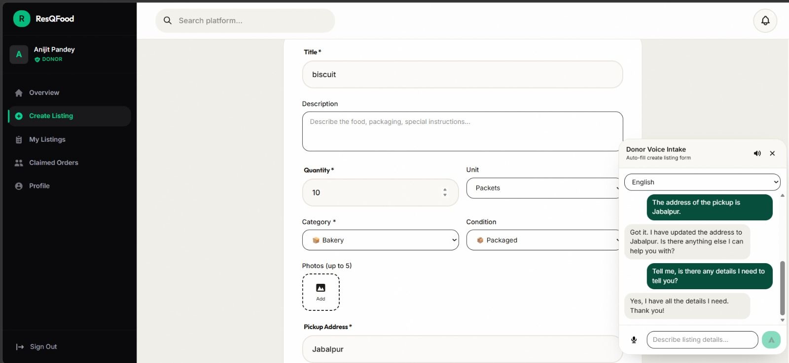

# 📝 Food Rescue: AI Voice Intake Engine

A frictionless, voice-driven data extraction engine. This microservice completely replaces traditional, multi-page donation forms. Donors can simply hold a button, speak naturally, and the AI will construct a perfectly formatted database entry.

 
## 🚀 The Problem It Solves
Street food vendors, local caterers, and busy hotel staff are massive sources of surplus food, but they abandon apps that require them to fill out 7-step forms while closing up shop. This engine removes the UI barrier completely, allowing them to donate food just by speaking, even in Hindi.

## ✨ Key Features
* **Conversational Form Filling:** Acts as a State Machine. If a user says "I have 50 plates of biryani," the AI knows the expiry time is missing and will ask for it.
* **Strict Schema Mapping:** Automatically categorizes messy human speech (e.g., "leftover pizza") into strict database enums (e.g., `category: 'cooked_meals'`, `unit: 'servings'`).
* **Dynamic Time Calculation:** Converts relative spoken time ("expires in 4 hours") into precise MongoDB `Date` objects.

## 🧠 Architecture Pipeline
1. **Input:** The donor speaks a sentence via the frontend interface. 
2. **Extraction (Gemini JSON Mode):** The text is sent to Gemini 1.5 Flash. We force Gemini to output a strict JSON object mapping the speech to our Mongoose schema rules.
3. **State Check:** The Node.js backend checks the JSON payload. 
   - *If incomplete:* Gemini generates a follow-up question (e.g., "When does this expire?"), ElevenLabs generates the audio, and the bot asks the user.
   - *If complete:* The backend constructs the final object.
4. **Database Write:** The validated data is saved directly into the MongoDB `FoodListings` collection.

## 🛠️ Tech Stack
* **Backend:** Node.js, Express, Socket.io
* **Database:** MongoDB, Mongoose
* **AI Logic Engine:** Google Gemini 1.5 Flash (Structured Output / JSON Mode)
* **Voice Engine:** ElevenLabs Multilingual V2

## 💻 Local Setup
1. Clone the repository and run `npm install`.
2. Create a `.env` file with the following variables:
   ```env
   PORT=5001
   MONGO_URI=your_mongodb_string
   GEMINI_API_KEY=your_gemini_key
   ELEVENLABS_API_KEY=your_elevenlabs_key
   ELEVENLABS_VOICE_ID=your_voice_id
3. For UI setup you can refer to the repo : .
